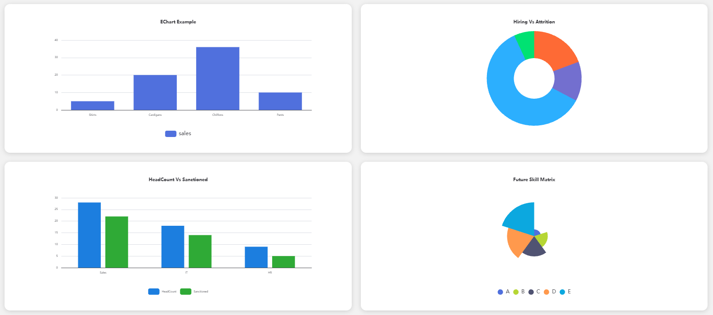
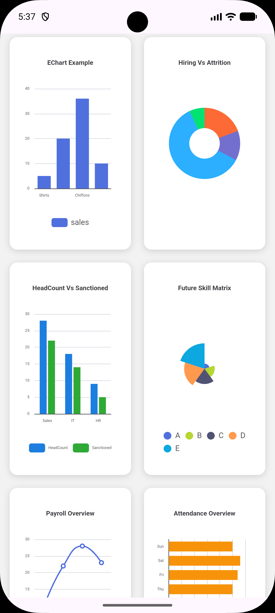

# 📊 Android WebView ECharts Dashboard

Interactive dashboard application built with **Android WebView** and **Apache ECharts**. This project demonstrates how to render beautiful and interactive charts using HTML, CSS, JavaScript, and display them inside an Android application.

---

## ✨ Features

* 📈 Bar Chart
* 📊 Horizontal Bar Chart
* 🥧 Pie Chart
* 📉 Line Chart
* 🗂️ Column Space Chart
* 🎨 Rose Chart

## 📂 Project Structure

```text
app
└── src
    └── main
        └── assets
            ├── echarts.js
            ├── index.html
```

---

## 🚀 Getting Started

### 1️⃣ Start Live Server

Open the project in **Android Studio**.

Navigate to:

```text
app/src/main/assets
```

Open the assets in **VS Code**.

Navigate to:

```text
app/src/main/assets/index.html
```

Right-click on:

```text
index.html
```

and select:

```text
Open with Live Server
```

Live Server will generate a URL similar to:

```text
http://127.0.0.1:5500/index.html
```

or

```text
http://192.168.x.x:5500/index.html
```

---

### 2️⃣ Configure Android WebView

Enable JavaScript and load the URL generated by Live Server:

```java
WebView webView = findViewById(R.id.webView);

webView.getSettings().setJavaScriptEnabled(true);

webView.loadUrl("http://192.168.x.x:5500/index.html");
```

> ⚠️ Make sure the Android device and computer are connected to the same Wi-Fi network.

---

## 📸 Layout

| 💻 Desktop Dashboard                          | 📱 Mobile Dashboard                         |
| --------------------------------------------- | ------------------------------------------- |
|  |  |


